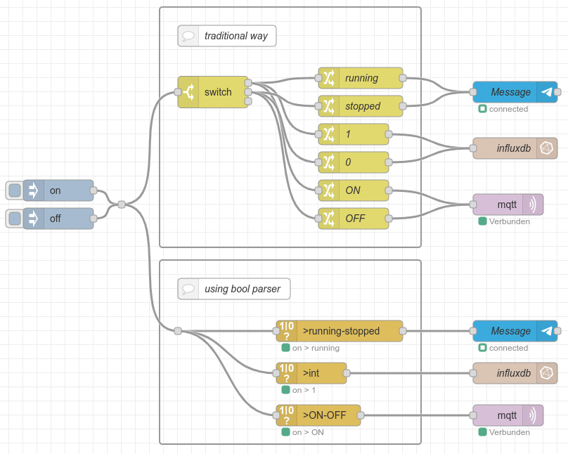
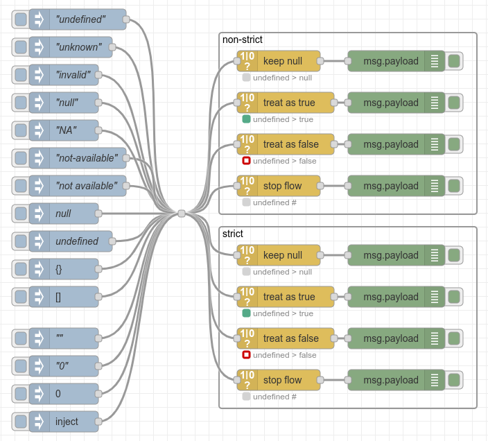

node-red-contrib-boolean-parser
==============================

# A [Node-RED](http://nodered.org) node to parse and convert several types of on/off, start/stop, true/false values.

[](https://nodered.org)

[](https://www.npmjs.com/package/node-red-contrib-boolean-parser)
[](https://www.npmjs.com/package/node-red-contrib-boolean-parser)
[](https://www.npmjs.org/package/node-red-contrib-boolean-parser)
[](https://snyk.io/test/npm/node-red-contrib-boolean-parser)
[](http://packagequality.com/#?package=node-red-contrib-boolean-parser)
[](https://github.com/simonbuttazzi/node-red-boolean-parser/issues)
[](https://github.com/simonbuttazzi/node-red-contrib-boolean-parser/issues?q=is%3Aissue+is%3Aclosed)

---
This packages provides an additional node in parser section. You can use it to transform properties describung boolean states. For example running or stopped (String) to 1 or 0 (int). Input values will be detected automatically.


## Install

### Webend

Burgermenu on the right -> Manage palette -> Tab Install -> serach for  _node-red-contrib-boolean-parser_ -> press install

### CLI
Run the following command in your Node-RED user directory - typically `~/.node-red`:

```
npm install node-red-contrib-boolean-parser
```

### Docker

Running node-red in an docker environment this should do the job:

Enter container:

```
docker exec -it <containername> /bin/bash
```
Inside container run the following command in your Node-RED user directory - typically `/data`:

```
npm install node-red-contrib-boolean-parser
```

## Usage

Think of a device stating running and stopped. You want to send string like ON or OFF in MQTT, write values like 1 and 0 to influxDB show messages status like enabled and disabled and following nodes exept boolean values.
 
To be honest nearly every type tranformation can be realized by multiple switch and change nodes or function nodes having individual code (see example below). But to keep it simple, stable and universal it is easier to have a node handling this and you don't need to blow up your flows.



Nodes can be configured like this:


### Input field

A field of the message, which contains the value to be parsed. Sub-properties like _msg.payload.state_ are also valid. 

### Output field

A field of the message, which should be used for output. A existing field will be overwritten. Sub-properties like _msg.payload.state_ are also valid.

### Supportet output formats
for boolean true and false

* true / false
* "true" / "false"
* "True" / "False"
* "TRUE" / "FALSE"
* 1 / 0
* "1" / "0"
* "start" / "stop"
* "started" / "stopped"
* "enable" / "disable"
* "enabled" / "disabled"
* "activated" / "deactivated"
* "active" / "inactive"
* "running" / "stopped"
* "run" / "stop"
* "on" / "off"
* "On" / "Off"
* "ON" / "OFF"

### Different outputs

There are two ways to send outgoing messages:

1. A combined **single output** sending all messages.
2. Three **split outputs**, sending messages, seperated by true/false/undefined.


### Input formats

All input values which represent a supportet output format are detected automatically. Additionally common rules try to evaluate values to true or false. Examples:

* "foobar" -> true
* "" -> false
* 42 -> true

### Input status

The last processed value is displayed as node status:

* **Color**: true (green), false (red), null (grey)
* **Text**: _input value_ > _output value_, (#) if flow was stopped


### Handle null value

If a value cant't be treaten as true or false, (e.g. _null_), it will be handled as defined by _Handle null values_:

* keep as null
* treat as true
* treat as false
* stop flow

## Examples

### Input and output formatsĸ


See [JSON](examples/conversion.json) for import.

### Null handling



See [JSON](examples/Handle Null.json) for import.

### Split outputs


See [JSON](examples/single-split-output.json) for import.

## Known Issues

* Input values like _undefined_, _unknown_, _invalid_, _undefined_, ... should be handled al _null_ automatically.

## Contribute

There are several ways to contribute to this project. You can [report](https://github.com/SimonButtazzi/node-red-contrib-boolean-parser/issues) bugs or [ask](https://github.com/SimonButtazzi/node-red-contrib-boolean-parser/issues) for new features directly on GitHub.
You can also submit your own new features of bug fixes via a [pull request](https://github.com/SimonButtazzi/node-red-contrib-boolean-parser/issueshttps://github.com/SimonButtazzi/node-red-contrib-boolean-parser/pr).

And of course you can always buy me a beer, coffee, ... via the donation button:

[](https://www.paypal.com/cgi-bin/webscr?cmd=_donations&business=simon%2ebuttazzi%40gmail%2ecom&lc=US&no_note=0&currency_code=EUR&bn=PP%2dDonationsBF%3abtn_donate_LG%2egif%3aNonHostedGuest)

## License

[MIT](LICENSE.md)